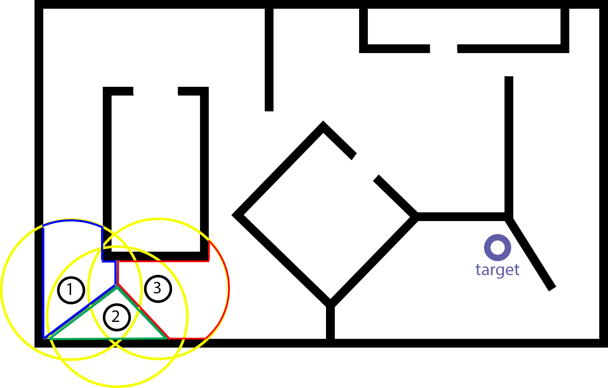

# Robot search and rescue

## Intro

The objective: Search an unknown environment for a specific target using cooperative robots. The robots have no previous knowledge of the environment and need to collaboratively explore the environment to find and rescue the target. We proposed a dynamic Voronoi partition-based exploration algorithm to ensure exploration. We further used two exploration strategies of picking the exploration target. The results show that our algorithm achieves better performance when more robots are deployed. The improved exploration strategy further increased the performance by a significant margin.


[](images/illustration.png)

## Project details
* We used ROS with python/c++ and Gazebo as simulation engine
* the robots are the turtlebot3 burger model with 2 drivable wheels and a lidar sensor
* The map is unknown and has obstacles. The robots start close to each other at one side of the map
* Used SLAM gmapping for localization and mapping
* Employed cooperative exploration approach using dynamic Voronoi partitions
* Robots explore map cooperatively until target is found
* Robots favor exploration until target is found
* The density function changes once the target is found to attarct them to go resuce it
* The explored map is shared between the robots to minimize duplication
* Used move base package for cost maps and local/gloabal planning
* Global planning uses A* and the local collision avoidance uses DWA 


The pipeline of the process:

[](images/pipeline.png)


Dynamic voronoi partitions for the unknown space:
[](images/dynamic_voronoi.png)

## Installation

please follow instructions in the install.md file

## Running
Please catkin_make before running. There are three launch files needed for the platform, navigation, and the voronoi node
```
cd ~/search_rescue
source setup.bash
roslaunch platform_start.launch
roslaunch turtlebot3_navigation multi_nav_bringup.launch
rosrun search_rescue voronoi_partition.py
```
